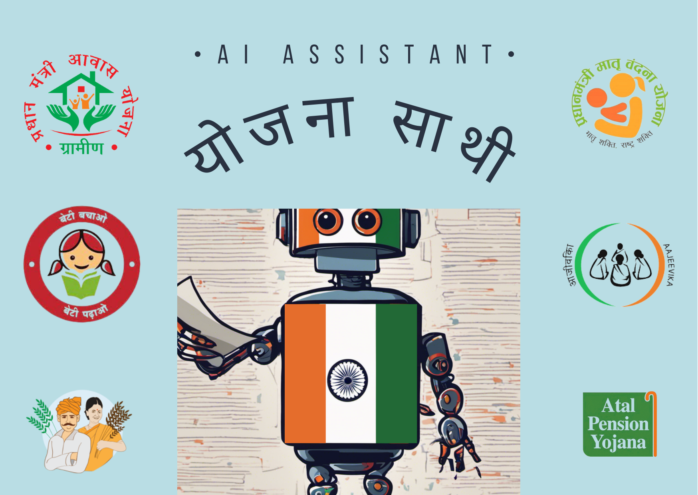

# योजना साथी 🔍 (Companion to find Govt schemes)



There are lot of different beneficial schemes made available by the Govt of India for various target groups: from farmers to senior citizens, physically disadvantaged people to students and many more. However, most of the eligible candidates are unaware of these schemes as the information spread across different state/ central Govt websites is not easily accessible and hard to find the relevant information. Language is another major barrier.

With this "योजना साथी " app, we aim to make this information easily accessible to the target groups in their native Hindi language. The app harnesses the power of LLMs (more specifically: the models made available by clarifai and langchain for search/ processing) to

* Shortlist the schemes relevant to any candidate based on their age/ profession/ location input
* Summarize the information relevant for applying for the scheme
* Translate the information and provide guidelines in easily accessible hindi language

# Technical Description

## Data Collection and Parsing

The primary source of information for government schemes is various state and central government websites, such as https://sje.gujarat.gov.in/schemes and https://www.tn.gov.in/scheme. To aggregate this scattered data, we use web scraping techniques to extract relevant content. Once retrieved, the data is parsed using LLMs to identify specific information points, including:

1. **Category Identification:** We extract categorization details related to gender, caste, occupation, and beneficiary type associated with each scheme. 

2. **Scheme Summary:** The LLMs extract essential details for each scheme, including its name, eligibility criteria, benefits, steps to avail the scheme, and the original source URL.

The parsed data is then structured and stored in a tabular format, allowing for efficient retrieval and query processing.

The codes for data collection and parsing can be found in the `data_processing.ipynb` notebook.


## User Query and Scheme Filtering

When a user interacts with the "योजना साथी" app to search for government schemes, the following steps are executed:

1. The app collects basic information from the user, which includes fields such as age, gender, caste, occupation, and beneficiary type. Using the user's input, the app filters the relevant schemes.
2. The app presents the relevant schemes to the user, displaying summaries in both English and Hindi. This ensures that the information is easily accessible to a broader audience.

The codes for user query and scheme filtering can be found in the `app.py` file.


# Getting Started

* create a `.streamlit/secert.toml` file with the following contents:

```text
CLARIFAI_PAT = ""
```

* run the app using

```bash
streamlit run app.py
```
